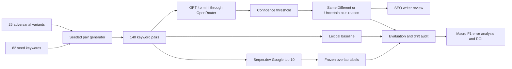

# IntentPair

PE6201 End-of-Course Project by Jiayao Ge, Section B.

IntentPair is a decision-support prototype for deciding whether two similar SEO keywords should be served by one page or two. It predicts Same, Different, or Uncertain from the keyword text and returns a short reason. Google top-10 SERP overlap is used only to create frozen evaluation labels; SERP data never enters the LLM prompt.

## Product documentation

### Persona and workflow

The primary user is a B2B SaaS SEO writer who reviews pre-grouped keyword sets without a dedicated SERP-clustering budget. The current workflow requires a manual Google comparison for every pair. At five minutes per pair, 100 decisions take about 8.33 hours.

IntentPair changes this into a selective-review workflow. High-confidence decisions can be prioritised, while uncertain or high-risk decisions remain with the writer. The prototype does not publish content or merge keyword groups automatically.

### Input

The working demo accepts two keyword strings:

```python
classify_v2("Google Search Scraper", "Free Google Search Scraper")
```

The evaluation pipeline processes a pair table with these main fields:

| Field | Meaning |
|---|---|
| `pair_id` | Stable integer identifier |
| `kw_a`, `kw_b` | The two keyword strings |
| `jaccard` | Token-Jaccard similarity used for sampling |
| `source` | `sampled` or `adversarial` |

### Output

The model returns a structured record:

```json
{
  "label": "Same",
  "confidence": 0.9,
  "reason": "Both keywords describe the same search task."
}
```

The system converts the raw model result into:

- Same or Different when confidence is at least 0.85;
- Uncertain when confidence is below 0.85;
- a short reason for writer review.

### Product architecture



The pair generator, label rules, orchestration, caching, evaluation, and observability are owned in the notebook. LLM inference is rented through OpenRouter, SERP retrieval through Serper.dev, and runtime infrastructure through Google Colab.

## Metrics targeted and reached

| Measure | Target | Actual | Outcome |
|---|---:|---:|---|
| Three-class macro-F1 | At least 0.700 | 0.438 | Not met |
| Improvement over stronger baseline | At least +0.100 | −0.153 versus lexical rule | Not met |
| Manual-review rate | At most 25% | 37.5% | Not met |
| Manual effort per 100 pairs | About 2.1 hours | 3.13 hours | Not met |
| Evaluation-run LLM cost | Below US$0.10 | About US$0.05 | Met |

### Model comparison

| System | Three-class macro-F1 on test n=120 |
|---|---:|
| Majority-class baseline | 0.234 |
| Tuned lexical-rule baseline | **0.591** |
| LLM v1 | 0.398 |
| LLM v2 with confidence-threshold abstention | 0.438 |

The LLM did not beat the simpler lexical rule. Its useful secondary signal was selective: on the 91 pairs with definite ground truth, answered cases had a 3.5% forced-choice error rate, compared with 41.2% among abstained cases. This supports a monitored pilot, not unconditional automation.

## Repository map

```text
notebooks/
  IntentPair_Colab_English.ipynb   complete implementation and saved outputs
data/
  adv_pairs.json                   25 adversarial keyword variants
  pairs.csv                        140 generated pairs
  serp_snapshot.json               frozen initial SERP results
  serp_meta.json                   snapshot provenance and locale
  ground_truth.csv                 labels and dev/test split
  llm_cache.json                   frozen v1 and v2 model responses
  drift_snapshot.json              submission-week SERP audit
  drift_meta.json                  drift collection provenance
results/
  predictions.csv                  v1 test predictions
  predictions_v2.csv               v2 test predictions
  drift_results.csv                20-pair drift comparison
DATA.md                            data provenance, schemas, and freeze policy
EVALS.md                           evaluation design and reproduction guide
REPORT.md                          business and technical trade-off analysis
requirements.txt                   Python dependencies
```

## Reproduce the saved analysis

The repository includes frozen SERP and LLM caches, so the reported analysis can be reproduced without new paid API calls.

1. Clone the repository or download it as a ZIP.
2. Open `notebooks/IntentPair_Colab_English.ipynb` in Google Colab.
3. To use Google Drive, copy the repository's `data/` and `results/` folders to `MyDrive/IntentPair/` and keep `USE_DRIVE = True`.
4. Alternatively, set `USE_DRIVE = False` and run with the folders beside the notebook.
5. Run the notebook from top to bottom.
6. Confirm the expected headline outputs: lexical macro-F1 0.591, LLM v2 macro-F1 0.438, review rate 37.5%, and drift movement 4/20.

Install the pinned minimum dependencies if the runtime does not already provide them:

```bash
pip install -r requirements.txt
```

Serper and OpenRouter credentials are required only when a cache entry is missing or when deliberately collecting fresh data. In Colab, store them as `SERPER_API_KEY` and `OPENROUTER_API_KEY` in Secrets. Never place credentials in the notebook or repository.

## Notebook code map

| Step | Responsibility | Main output |
|---|---|---|
| 0 | Configuration, secrets, paths, and optional Drive mount | Runtime configuration |
| 1–2 | Seed data, adversarial variants, and reproducible pair generation | `pairs.csv` |
| 3 | SERP retrieval, overlap calculation, labels, and drift audit | Frozen data and `drift_results.csv` |
| 4 | Majority and lexical baselines | Baseline predictions and scores |
| 5–6 | V1 LLM prompt, cached inference, and primary evaluation | `predictions.csv` |
| 5b–6c | V2 confidence routing and diagnostic comparison | `predictions_v2.csv` |
| 7 | Time saving, error-cost sensitivity, and break-even analysis | Business outcome calculations |

## Evaluation and limitations

The primary metric is three-class macro-F1. The 20 development pairs are used for few-shot examples and threshold selection; the 120 test pairs are held out for final scoring. Labels are frozen before LLM evaluation:

- overlap = 0 → Different;
- 0 < overlap < 0.3 → Uncertain;
- overlap ≥ 0.3 → Same.

During the submission-week audit, four of 20 labels moved and overlap MAE was 0.030. All movements were between Different and Uncertain. Other important limitations are the small development set, the measurement-band definition of Uncertain, Jaccard-based sampling that favours the lexical baseline, and only four v2 Same predictions.

See [DATA.md](DATA.md), [EVALS.md](EVALS.md), and [REPORT.md](REPORT.md) for full details.
